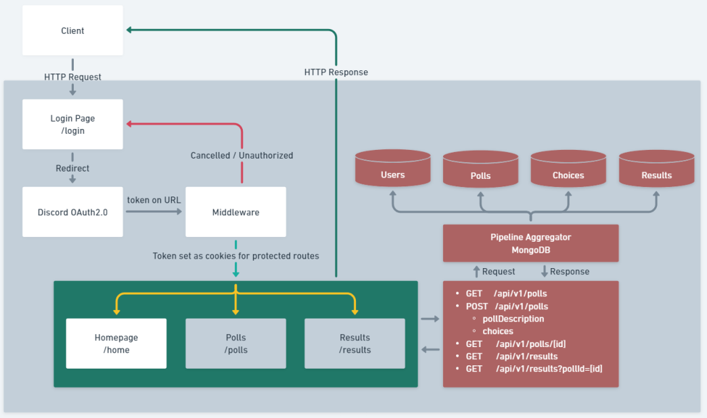

# System Design

- [System Design](#system-design)
  - [Storytelling System Architecture](#storytelling-system-architecture)
    - [User Requirements:](#user-requirements)
    - [Technology Stack:](#technology-stack)
    - [Frontend Routes:](#frontend-routes)
    - [Backend Routes:](#backend-routes)
    - [Architecture Components:](#architecture-components)
    - [User Flow:](#user-flow)
  - [Technical Design](#technical-design)

## Storytelling System Architecture

### User Requirements:

- All users must have a Discord Account
- All users must be a member of Daedalus server
- All users must authorize this webapp thru Discord OAuth2.0
- All users must log in

### Technology Stack:

- Frontend: [NEXT.js](https://nextjs.org/docs)
- UI Prototyping: [Figma](https://figma.com/)
- Authentication: [Discord OAuth2.0 API](https://discord.com/developers/docs/topics/oauth2)
- Authorization: [NextAuth.js](https://next-auth.js.org/)
- Git Control: [Github](https://github.com/)
- Database: [MongoDB](https://mongodb.com/)
- Deployment: [Cloudflare](http://cloudflare.com/)

### Frontend Routes:

1. `/` - Landing page
2. `/login` - Login page where users can initiate Discord OAuth2.0 authentication.
3. `/home` - Homepage for logged-in users. It displays their votes, quick results, and contains the pollForm component for creating polls.
4. `/polls` - Displays a list of available polls. When clicked, it opens a voteForm modal for users to vote. If they already voted, the form highlights their previous choice.
5. `/results` - Displays a list of polls and their winners. When clicked, it shows a graph of votes per choices.

### Backend Routes:

1. **GET** `/api/v1/auth/login`
   - **Purpose:** Decide whether to redirect the user back to `/login` or to `/home`.
   - **Request Parameters:**
     - `access_token` (string): Token from [Discord OAuth2.0 API](https://discord.com/developers/docs/topics/oauth2).
     - `token_type` (string): Token type.
   - **Response:** authorization token in the format of "`{tokenType} {accessToken}`" set as cookies. This Authorization token is required to be sent with any API calls to Discord. Example Usage:
   ```js
   const response = await fetch('https://discord.com/api/users/@me', {
   	headers: {
   		authorization: `${tokenType} ${accessToken}`
   	}
   });
   ```
2. **GET** `/api/v1/polls`

   - **Purpose:** Retrieve a list of available polls.
   - **Response:** A list of polls, each containing `pollDescription` and choices.

3. **POST** `/api/v1/polls`

   - **Purpose:** Create a new poll.
   - **Request Method:** POST
   - **Request Parameters:**
     - `pollDescription` (string): A description of the poll, which should be a question.
     - `choices` (array of strings): Options that other users can vote on.
   - **Response:** Confirmation of the newly created poll.

4. **GET** `/api/v1/polls/[id]`

   - **Purpose:** Retrieve a specific poll by its unique identifier.
   - **Request Parameters:**
     - `id` (string): The unique identifier of the poll.
   - **Response:** Details of the specified poll, including `pollDescription` and choices.

5. **GET** `/api/v1/results`

   - **Purpose:** Retrieve a list of polls and their respective winners.
   - **Response:** A list of polls and their winners.

6. **GET** `/api/v1/results?pollId=[id]`
   - **Purpose:** Retrieve the results of a specific poll by its unique identifier.
   - **Request Parameters:**
     - `pollId` (string): The unique identifier of the poll.
   - **Response:** Results of the specified poll, including the `pollDescription` and vote counts for each choice.

### Architecture Components:

1. **Frontend**:

   - Develop a web application that users can access.
   - Implement Discord OAuth2.0 for user authentication and authorization.
   - Create a homepage to display polls.

2. **Backend**:

   - Use a Node.js server to handle the backend logic.
   - Integrate with Discord API for user verification and to check if they are members of the Daedalus server.
   - Use MongoDB to store poll data and vote data.

3. **Database**:
   - MongoDB will store poll data and vote data. Create two collections: "Polls" and "Votes."
   - Each poll document should include fields for `pollDescription`(string), choices (an array of strings), and a unique identifier.
   - Each vote document should include fields for the user's choice and reference the poll's unique identifier.

### User Flow:

1. Users visit the web application and log in using Discord OAuth2.0.

2. After authentication, the server route `/api/v1/auth/login` determines whether to redirect the user to `/login` or `/home`.

3. Users on `/home` can see their votes, quick results, and access the pollForm component to create polls.

4. Users on `/polls` can view available polls, open voteForm modals to vote, and see their previous votes highlighted.

5. Users on `/results` can view a list of polls and their winners, with the option to see a graph of votes per choices.

## Technical Design


